Forest Fire Area Prediction
================

## Using a few ML algorithms, predict the area of a forest fire based on meteorological conditions, per the data set (<https://archive.ics.uci.edu/ml/datasets/forest+fires>) and approach outlined in \[Cortez and Morais, 2007\] P. Cortez and A. Morais. A Data Mining Approach to Predict Forest Fires using Meteorological Data.

### Compare the efficiency, error, and accuracy of each algorithm employed

### set working directory and load needed packages

``` r
knitr::opts_knit$set(root.dir = 'C:/Users/tscott/')
```

``` r
# load packages
library(tidyverse) #for ggplot and dplyr
```

    ## ── Attaching packages ─────────────────────────────────────── tidyverse 1.3.2 ──
    ## ✔ ggplot2 3.3.6     ✔ purrr   0.3.4
    ## ✔ tibble  3.1.8     ✔ dplyr   1.0.9
    ## ✔ tidyr   1.2.0     ✔ stringr 1.4.0
    ## ✔ readr   2.1.2     ✔ forcats 0.5.1
    ## ── Conflicts ────────────────────────────────────────── tidyverse_conflicts() ──
    ## ✖ dplyr::filter() masks stats::filter()
    ## ✖ dplyr::lag()    masks stats::lag()

``` r
library(corrplot) #for correlation plots
```

    ## corrplot 0.92 loaded

### Get the data

Pre-downloaded from
<https://archive.ics.uci.edu/ml/datasets/forest+fires>

``` r
forestRaw <- read.csv("./OneDrive - Eastside Preparatory School/Courses/DataScience_2/data/forestfires.csv")
```

### From the documentation for the data set

Attribute information:

For more information, read \[Cortez and Morais, 2007\].

1.  X - x-axis spatial coordinate within the Montesinho park map: 1 to 9
2.  Y - y-axis spatial coordinate within the Montesinho park map: 2 to 9
3.  month - month of the year: “jan” to “dec”
4.  day - day of the week: “mon” to “sun”
5.  FFMC - FFMC index from the FWI system: 18.7 to 96.20
6.  DMC - DMC index from the FWI system: 1.1 to 291.3
7.  DC - DC index from the FWI system: 7.9 to 860.6
8.  ISI - ISI index from the FWI system: 0.0 to 56.10
9.  temp - temperature in Celsius degrees: 2.2 to 33.30
10. RH - relative humidity in %: 15.0 to 100
11. wind - wind speed in km/h: 0.40 to 9.40
12. rain - outside rain in mm/m2 : 0.0 to 6.4
13. area - the burned area of the forest (in ha): 0.00 to 1090.84 (this
    output variable is very skewed towards 0.0, thus it may make sense
    to model with the logarithm transform).

Need to watch out for correlations, e.g., the Initial Spread Index (ISI)
is a numeric rating of the expected rate of fire spread. It is based on
wind speed and FFMC.

More deets:
<https://wikifire.wsl.ch/tiki-indexbdbc.html?page=Canadian+forest+fire+weather+index+system>

### Inspect it and check for correlations

``` r
summary(forestRaw)
```

    ##        X               Y          month               day           
    ##  Min.   :1.000   Min.   :2.0   Length:517         Length:517        
    ##  1st Qu.:3.000   1st Qu.:4.0   Class :character   Class :character  
    ##  Median :4.000   Median :4.0   Mode  :character   Mode  :character  
    ##  Mean   :4.669   Mean   :4.3                                        
    ##  3rd Qu.:7.000   3rd Qu.:5.0                                        
    ##  Max.   :9.000   Max.   :9.0                                        
    ##       FFMC            DMC              DC             ISI        
    ##  Min.   :18.70   Min.   :  1.1   Min.   :  7.9   Min.   : 0.000  
    ##  1st Qu.:90.20   1st Qu.: 68.6   1st Qu.:437.7   1st Qu.: 6.500  
    ##  Median :91.60   Median :108.3   Median :664.2   Median : 8.400  
    ##  Mean   :90.64   Mean   :110.9   Mean   :547.9   Mean   : 9.022  
    ##  3rd Qu.:92.90   3rd Qu.:142.4   3rd Qu.:713.9   3rd Qu.:10.800  
    ##  Max.   :96.20   Max.   :291.3   Max.   :860.6   Max.   :56.100  
    ##       temp             RH              wind            rain        
    ##  Min.   : 2.20   Min.   : 15.00   Min.   :0.400   Min.   :0.00000  
    ##  1st Qu.:15.50   1st Qu.: 33.00   1st Qu.:2.700   1st Qu.:0.00000  
    ##  Median :19.30   Median : 42.00   Median :4.000   Median :0.00000  
    ##  Mean   :18.89   Mean   : 44.29   Mean   :4.018   Mean   :0.02166  
    ##  3rd Qu.:22.80   3rd Qu.: 53.00   3rd Qu.:4.900   3rd Qu.:0.00000  
    ##  Max.   :33.30   Max.   :100.00   Max.   :9.400   Max.   :6.40000  
    ##       area        
    ##  Min.   :   0.00  
    ##  1st Qu.:   0.00  
    ##  Median :   0.52  
    ##  Mean   :  12.85  
    ##  3rd Qu.:   6.57  
    ##  Max.   :1090.84

``` r
# might want to set the month and day to factors
# but for correlation we can only use numeric values

forestNum <- forestRaw %>% select(-month, -day)
corrs <- cor(forestNum)
corrplot(corrs, order = 'hclust', addrect = 2)
```

<!-- -->

### Quite a bit of correlation, especially between temp and the FWI values. Note that there are NO strong correlations with our goal, area

### Having variables that correlate strongly can both make your model worse and make it prone to overfitting - training well on the train data and poor performance on anything else

### When you read the paper by the authors \[Cortez and Morais, 2007\], you’ll notice they took

")

### (area + 1 to avoid log of zero) so the range wasn’t so high. Let’s do that. But we have to remember to do


afterward to get back to actual area

``` r
forestNum <- forestNum %>% mutate(logArea = log(area+1))
summary(forestNum)
```

    ##        X               Y            FFMC            DMC              DC       
    ##  Min.   :1.000   Min.   :2.0   Min.   :18.70   Min.   :  1.1   Min.   :  7.9  
    ##  1st Qu.:3.000   1st Qu.:4.0   1st Qu.:90.20   1st Qu.: 68.6   1st Qu.:437.7  
    ##  Median :4.000   Median :4.0   Median :91.60   Median :108.3   Median :664.2  
    ##  Mean   :4.669   Mean   :4.3   Mean   :90.64   Mean   :110.9   Mean   :547.9  
    ##  3rd Qu.:7.000   3rd Qu.:5.0   3rd Qu.:92.90   3rd Qu.:142.4   3rd Qu.:713.9  
    ##  Max.   :9.000   Max.   :9.0   Max.   :96.20   Max.   :291.3   Max.   :860.6  
    ##       ISI              temp             RH              wind      
    ##  Min.   : 0.000   Min.   : 2.20   Min.   : 15.00   Min.   :0.400  
    ##  1st Qu.: 6.500   1st Qu.:15.50   1st Qu.: 33.00   1st Qu.:2.700  
    ##  Median : 8.400   Median :19.30   Median : 42.00   Median :4.000  
    ##  Mean   : 9.022   Mean   :18.89   Mean   : 44.29   Mean   :4.018  
    ##  3rd Qu.:10.800   3rd Qu.:22.80   3rd Qu.: 53.00   3rd Qu.:4.900  
    ##  Max.   :56.100   Max.   :33.30   Max.   :100.00   Max.   :9.400  
    ##       rain              area            logArea      
    ##  Min.   :0.00000   Min.   :   0.00   Min.   :0.0000  
    ##  1st Qu.:0.00000   1st Qu.:   0.00   1st Qu.:0.0000  
    ##  Median :0.00000   Median :   0.52   Median :0.4187  
    ##  Mean   :0.02166   Mean   :  12.85   Mean   :1.1110  
    ##  3rd Qu.:0.00000   3rd Qu.:   6.57   3rd Qu.:2.0242  
    ##  Max.   :6.40000   Max.   :1090.84   Max.   :6.9956

## multi-linear regression

### We’ll naively try with all the numeric values. We’re doing no normalization and not removing any that correlate with others, so we don’t expect a great result.

``` r
# We're going to use 80% of the rows to train the model
# then test it out on the remaining 20% of the data

# Create Training and Test data -
set.seed(732)  # setting seed to reproduce results of random sampling

# create row indices for training data
# sample will choose random row numbers (80% of the total number of rows)
trainingRowIndex <- sample(1:nrow(forestNum), 0.8*nrow(forestNum)) 

# use those row numbers to split up the data into rows for training 
# and rows for testing

# model training data are the rows that sample identified above
trainingData <- forestNum[trainingRowIndex, ]  

# model test data are the remaining rows
# the minus sign says  to take "all rows but those in trainingRowIndex"
testData  <- forestNum[-trainingRowIndex, ]

# make the model
# remember to use the logArea outcome rather than area
mlrModel <- lm(data=trainingData, logArea ~ .-area)
summary(mlrModel)
```

    ## 
    ## Call:
    ## lm(formula = logArea ~ . - area, data = trainingData)
    ## 
    ## Residuals:
    ##     Min      1Q  Median      3Q     Max 
    ## -1.7753 -1.0993 -0.5617  0.9186  4.9326 
    ## 
    ## Coefficients:
    ##               Estimate Std. Error t value Pr(>|t|)  
    ## (Intercept) -0.4178970  1.9960909  -0.209   0.8343  
    ## X            0.0489166  0.0356835   1.371   0.1712  
    ## Y           -0.0283504  0.0674614  -0.420   0.6745  
    ## FFMC         0.0130635  0.0213910   0.611   0.5417  
    ## DMC          0.0023941  0.0016680   1.435   0.1520  
    ## DC           0.0001185  0.0004079   0.291   0.7715  
    ## ISI         -0.0246378  0.0189891  -1.297   0.1952  
    ## temp         0.0028349  0.0199384   0.142   0.8870  
    ## RH          -0.0048908  0.0060966  -0.802   0.4229  
    ## wind         0.0863988  0.0420753   2.053   0.0407 *
    ## rain         0.0749754  0.2168086   0.346   0.7297  
    ## ---
    ## Signif. codes:  0 '***' 0.001 '**' 0.01 '*' 0.05 '.' 0.1 ' ' 1
    ## 
    ## Residual standard error: 1.403 on 402 degrees of freedom
    ## Multiple R-squared:  0.03041,    Adjusted R-squared:  0.006288 
    ## F-statistic: 1.261 on 10 and 402 DF,  p-value: 0.2508

### Wow, only wind among the variables is significant, with high p-values for most 0.05 and an overall p-value of 0.218 with a terrible R-squared as well

### The median residual value is -0.585, and remember that is in log units so not very close to zero. We should look at a Q-Q plot and histogram of the residuals but it is safe to say they won’t be good

``` r
# Q-Q plot is a test for normally distributed residuals (2nd plot in the sequence)
# should be on a 45 deg line with little deviation
plot(mlrModel)
```

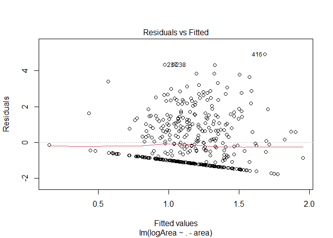<!-- -->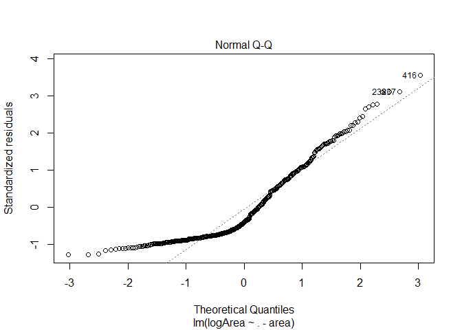<!-- -->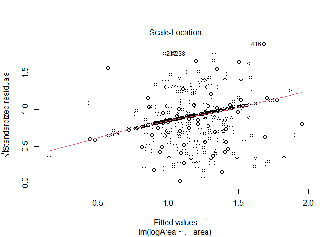<!-- -->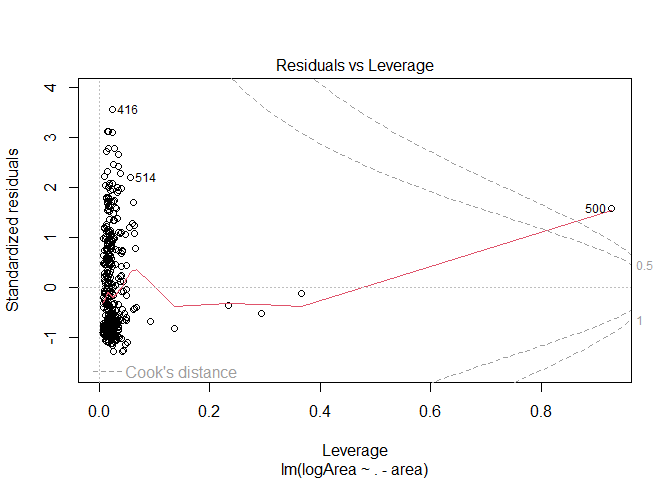<!-- -->

``` r
# histogram shows us something similar
ggplot(data=mlrModel, aes(x=mlrModel$residuals)) + geom_histogram()
```

    ## `stat_bin()` using `bins = 30`. Pick better value with `binwidth`.

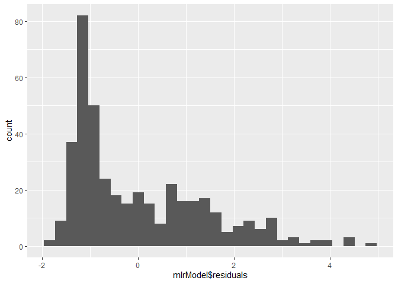<!-- -->

## Finally, let’s look at our main measure of goodness we’ll be using, the RMSE (root mean squared error)

^2}{n}}")

``` r
# get values the model predicts for the test set
predictedArea <- predict(mlrModel, newdata=testData)

# calculation root mean squared error
(rmse_mlr <- sqrt(mean((predictedArea - testData$logArea) ^ 2, na.rm = TRUE)))
```

    ## [1] 1.377032

### We’ll need that many times, so let’s make an RMSE function to use

``` r
myRMSE <- function(pred, obs) {
  return(sqrt(mean((pred - obs) ^ 2, na.rm = TRUE)))
}


# make sure it works
myRMSE(predictedArea,testData$logArea )
```

    ## [1] 1.377032

### Note that this is the error for the natural logged data and it still really sucks - we’re way off of a decent model (which we might have predicted from the high median residuals and terrible stats)

## Do we give up? Heck no! There are other algorithms!

## Decision Tree

``` r
# packages for decision trees
#install.packages(c("rpart","rpart.plot","rattle"))
library(rpart)
library(rpart.plot)
library(RColorBrewer)
library(rattle)
```

    ## Loading required package: bitops

    ## Rattle: A free graphical interface for data science with R.
    ## Version 5.5.1 Copyright (c) 2006-2021 Togaware Pty Ltd.
    ## Type 'rattle()' to shake, rattle, and roll your data.

``` r
# build the tree
start1 <- Sys.time()
myTree <- rpart(data=trainingData, logArea ~ .-area, method='anova')
end1 <- Sys.time()          # Finishing time
(time1 <- end1 - start1) # total time
```

    ## Time difference of 0.03075409 secs

``` r
# check it out and plot the tree
#plot(myTree)
#text(myTree,pretty=0)
summary(myTree)
```

    ## Call:
    ## rpart(formula = logArea ~ . - area, data = trainingData, method = "anova")
    ##   n= 413 
    ## 
    ##            CP nsplit rel error   xerror       xstd
    ## 1  0.02246242      0 1.0000000 1.008139 0.07769285
    ## 2  0.02236346      1 0.9775376 1.050428 0.07981928
    ## 3  0.01893917      2 0.9551741 1.073098 0.08107304
    ## 4  0.01763564      5 0.8978239 1.126865 0.08894216
    ## 5  0.01762558      6 0.8801882 1.134344 0.08911857
    ## 6  0.01533431      7 0.8625627 1.186233 0.08980312
    ## 7  0.01383583      8 0.8472283 1.220325 0.09167561
    ## 8  0.01353482     11 0.8057208 1.231776 0.09204576
    ## 9  0.01219311     12 0.7921860 1.250810 0.09334249
    ## 10 0.01184207     13 0.7799929 1.262736 0.09386906
    ## 11 0.01087515     14 0.7681508 1.255557 0.09392397
    ## 12 0.01009564     15 0.7572757 1.248570 0.09422280
    ## 13 0.01000000     16 0.7471800 1.250988 0.09295809
    ## 
    ## Variable importance
    ## temp   RH    X  ISI FFMC  DMC   DC    Y wind 
    ##   23   16   14   12   12   10    6    4    3 
    ## 
    ## Node number 1: 413 observations,    complexity param=0.02246242
    ##   mean=1.163288, MSE=1.97695 
    ##   left son=2 (368 obs) right son=3 (45 obs)
    ##   Primary splits:
    ##       temp < 26     to the left,  improve=0.022462420, (0 missing)
    ##       DMC  < 118.45 to the left,  improve=0.020354510, (0 missing)
    ##       wind < 8.25   to the left,  improve=0.015266050, (0 missing)
    ##       DC   < 243.2  to the left,  improve=0.010186080, (0 missing)
    ##       X    < 7.5    to the left,  improve=0.008374373, (0 missing)
    ##   Surrogate splits:
    ##       FFMC < 95.65  to the left,  agree=0.898, adj=0.067, (0 split)
    ## 
    ## Node number 2: 368 observations,    complexity param=0.02236346
    ##   mean=1.089598, MSE=1.838281 
    ##   left son=4 (359 obs) right son=5 (9 obs)
    ##   Primary splits:
    ##       temp < 5.2    to the right, improve=0.026991370, (0 missing)
    ##       wind < 8.25   to the left,  improve=0.020737680, (0 missing)
    ##       DMC  < 118.45 to the left,  improve=0.013430760, (0 missing)
    ##       DC   < 243.2  to the left,  improve=0.007176048, (0 missing)
    ##       ISI  < 1.85   to the left,  improve=0.006673795, (0 missing)
    ## 
    ## Node number 3: 45 observations,    complexity param=0.01533431
    ##   mean=1.765908, MSE=2.703396 
    ##   left son=6 (27 obs) right son=7 (18 obs)
    ##   Primary splits:
    ##       temp < 27.55  to the right, improve=0.10291720, (0 missing)
    ##       RH   < 24.5   to the left,  improve=0.10102810, (0 missing)
    ##       wind < 2.9    to the left,  improve=0.09016065, (0 missing)
    ##       Y    < 5.5    to the left,  improve=0.08850095, (0 missing)
    ##       DMC  < 177.95 to the left,  improve=0.08278272, (0 missing)
    ##   Surrogate splits:
    ##       RH   < 33.5   to the left,  agree=0.778, adj=0.444, (0 split)
    ##       FFMC < 93.15  to the right, agree=0.711, adj=0.278, (0 split)
    ##       DC   < 486.4  to the right, agree=0.667, adj=0.167, (0 split)
    ##       X    < 4.5    to the left,  agree=0.644, adj=0.111, (0 split)
    ##       DMC  < 220.05 to the left,  agree=0.622, adj=0.056, (0 split)
    ## 
    ## Node number 4: 359 observations,    complexity param=0.01893917
    ##   mean=1.054329, MSE=1.82161 
    ##   left son=8 (221 obs) right son=9 (138 obs)
    ##   Primary splits:
    ##       DMC  < 118.45 to the left,  improve=0.016958920, (0 missing)
    ##       DC   < 568.85 to the left,  improve=0.012256360, (0 missing)
    ##       ISI  < 2.95   to the left,  improve=0.010772720, (0 missing)
    ##       FFMC < 84.3   to the left,  improve=0.009247677, (0 missing)
    ##       temp < 19.85  to the left,  improve=0.008998948, (0 missing)
    ##   Surrogate splits:
    ##       DC   < 780.3  to the left,  agree=0.694, adj=0.203, (0 split)
    ##       FFMC < 92.45  to the left,  agree=0.674, adj=0.152, (0 split)
    ##       ISI  < 10     to the left,  agree=0.660, adj=0.116, (0 split)
    ##       temp < 19.35  to the left,  agree=0.635, adj=0.051, (0 split)
    ##       RH   < 57.5   to the left,  agree=0.635, adj=0.051, (0 split)
    ## 
    ## Node number 5: 9 observations
    ##   mean=2.496437, MSE=0.4744422 
    ## 
    ## Node number 6: 27 observations,    complexity param=0.01009564
    ##   mean=1.33523, MSE=1.858823 
    ##   left son=12 (14 obs) right son=13 (13 obs)
    ##   Primary splits:
    ##       ISI  < 13.95  to the left,  improve=0.16423970, (0 missing)
    ##       Y    < 4.5    to the left,  improve=0.15596250, (0 missing)
    ##       FFMC < 93.45  to the left,  improve=0.08944535, (0 missing)
    ##       wind < 2.45   to the left,  improve=0.05206519, (0 missing)
    ##       RH   < 28.5   to the left,  improve=0.04005768, (0 missing)
    ##   Surrogate splits:
    ##       FFMC < 93.55  to the left,  agree=0.852, adj=0.692, (0 split)
    ##       wind < 3.8    to the left,  agree=0.778, adj=0.538, (0 split)
    ##       DC   < 698.2  to the right, agree=0.741, adj=0.462, (0 split)
    ##       temp < 30.5   to the left,  agree=0.704, adj=0.385, (0 split)
    ##       Y    < 3.5    to the left,  agree=0.667, adj=0.308, (0 split)
    ## 
    ## Node number 7: 18 observations
    ##   mean=2.411926, MSE=3.274692 
    ## 
    ## Node number 8: 221 observations,    complexity param=0.01763564
    ##   mean=0.9154391, MSE=1.62427 
    ##   left son=16 (123 obs) right son=17 (98 obs)
    ##   Primary splits:
    ##       X    < 5.5    to the left,  improve=0.04011313, (0 missing)
    ##       RH   < 52.5   to the left,  improve=0.01704420, (0 missing)
    ##       temp < 19.95  to the left,  improve=0.01693087, (0 missing)
    ##       DC   < 730.95 to the left,  improve=0.01647103, (0 missing)
    ##       FFMC < 92.25  to the right, improve=0.01502681, (0 missing)
    ##   Surrogate splits:
    ##       Y    < 4.5    to the left,  agree=0.652, adj=0.214, (0 split)
    ##       FFMC < 86.7   to the right, agree=0.597, adj=0.092, (0 split)
    ##       DMC  < 74.35  to the right, agree=0.588, adj=0.071, (0 split)
    ##       temp < 23.85  to the left,  agree=0.579, adj=0.051, (0 split)
    ##       DC   < 56.05  to the right, agree=0.575, adj=0.041, (0 split)
    ## 
    ## Node number 9: 138 observations,    complexity param=0.01893917
    ##   mean=1.276754, MSE=2.057275 
    ##   left son=18 (97 obs) right son=19 (41 obs)
    ##   Primary splits:
    ##       X    < 2.5    to the right, improve=0.06987046, (0 missing)
    ##       ISI  < 9.65   to the right, improve=0.03917022, (0 missing)
    ##       DMC  < 133.45 to the right, improve=0.03874798, (0 missing)
    ##       Y    < 3.5    to the right, improve=0.02910283, (0 missing)
    ##       temp < 23.65  to the right, improve=0.02483533, (0 missing)
    ##   Surrogate splits:
    ##       Y    < 2.5    to the right, agree=0.804, adj=0.341, (0 split)
    ##       temp < 24.7   to the left,  agree=0.725, adj=0.073, (0 split)
    ## 
    ## Node number 12: 14 observations
    ##   mean=0.8027958, MSE=1.399072 
    ## 
    ## Node number 13: 13 observations
    ##   mean=1.90862, MSE=1.719869 
    ## 
    ## Node number 16: 123 observations
    ##   mean=0.6875975, MSE=1.163808 
    ## 
    ## Node number 17: 98 observations,    complexity param=0.01383583
    ##   mean=1.201403, MSE=2.055267 
    ##   left son=34 (9 obs) right son=35 (89 obs)
    ##   Primary splits:
    ##       RH   < 71.5   to the right, improve=0.04459160, (0 missing)
    ##       DMC  < 37.75  to the left,  improve=0.04107332, (0 missing)
    ##       wind < 2.9    to the left,  improve=0.03993324, (0 missing)
    ##       FFMC < 84.3   to the left,  improve=0.03437500, (0 missing)
    ##       ISI  < 9.3    to the left,  improve=0.03263788, (0 missing)
    ##   Surrogate splits:
    ##       FFMC < 71.5   to the left,  agree=0.929, adj=0.222, (0 split)
    ##       ISI  < 0.95   to the left,  agree=0.929, adj=0.222, (0 split)
    ##       DC   < 27.45  to the left,  agree=0.918, adj=0.111, (0 split)
    ## 
    ## Node number 18: 97 observations,    complexity param=0.01762558
    ##   mean=1.030264, MSE=1.678192 
    ##   left son=36 (90 obs) right son=37 (7 obs)
    ##   Primary splits:
    ##       RH   < 28.5   to the right, improve=0.08840483, (0 missing)
    ##       X    < 3.5    to the left,  improve=0.08239744, (0 missing)
    ##       DMC  < 138.75 to the right, improve=0.04960099, (0 missing)
    ##       ISI  < 9.45   to the right, improve=0.04226063, (0 missing)
    ##       wind < 5.6    to the left,  improve=0.02843419, (0 missing)
    ##   Surrogate splits:
    ##       DMC < 121.55 to the right, agree=0.948, adj=0.286, (0 split)
    ## 
    ## Node number 19: 41 observations,    complexity param=0.01893917
    ##   mean=1.859913, MSE=2.470315 
    ##   left son=38 (16 obs) right son=39 (25 obs)
    ##   Primary splits:
    ##       temp < 22.05  to the right, improve=0.15697040, (0 missing)
    ##       RH   < 39.5   to the left,  improve=0.07882535, (0 missing)
    ##       DMC  < 136.35 to the right, improve=0.07115799, (0 missing)
    ##       wind < 2.9    to the right, improve=0.06012008, (0 missing)
    ##       DC   < 654.05 to the right, improve=0.04543306, (0 missing)
    ##   Surrogate splits:
    ##       RH   < 37     to the left,  agree=0.756, adj=0.375, (0 split)
    ##       FFMC < 91.75  to the right, agree=0.683, adj=0.188, (0 split)
    ##       wind < 5.15   to the right, agree=0.683, adj=0.188, (0 split)
    ##       DC   < 588.3  to the left,  agree=0.634, adj=0.063, (0 split)
    ##       ISI  < 7.95   to the right, agree=0.634, adj=0.063, (0 split)
    ## 
    ## Node number 34: 9 observations
    ##   mean=0.2494089, MSE=0.2181457 
    ## 
    ## Node number 35: 89 observations,    complexity param=0.01383583
    ##   mean=1.297673, MSE=2.140128 
    ##   left son=70 (76 obs) right son=71 (13 obs)
    ##   Primary splits:
    ##       RH   < 53.5   to the left,  improve=0.06184885, (0 missing)
    ##       wind < 2.9    to the left,  improve=0.04220649, (0 missing)
    ##       DMC  < 37.75  to the left,  improve=0.03848059, (0 missing)
    ##       ISI  < 9.3    to the left,  improve=0.02967787, (0 missing)
    ##       DC   < 734    to the left,  improve=0.02086198, (0 missing)
    ##   Surrogate splits:
    ##       temp < 7.85   to the right, agree=0.899, adj=0.308, (0 split)
    ## 
    ## Node number 36: 90 observations,    complexity param=0.01219311
    ##   mean=0.9228436, MSE=1.45951 
    ##   left son=72 (20 obs) right son=73 (70 obs)
    ##   Primary splits:
    ##       X    < 3.5    to the left,  improve=0.07578982, (0 missing)
    ##       wind < 5.6    to the left,  improve=0.05158478, (0 missing)
    ##       DMC  < 143.9  to the right, improve=0.02311376, (0 missing)
    ##       ISI  < 7.55   to the right, improve=0.02177809, (0 missing)
    ##       Y    < 3.5    to the right, improve=0.02126203, (0 missing)
    ##   Surrogate splits:
    ##       wind < 1.1    to the left,  agree=0.789, adj=0.05, (0 split)
    ## 
    ## Node number 37: 7 observations
    ##   mean=2.411383, MSE=2.433965 
    ## 
    ## Node number 38: 16 observations
    ##   mean=1.081527, MSE=1.047752 
    ## 
    ## Node number 39: 25 observations,    complexity param=0.01184207
    ##   mean=2.35808, MSE=2.744818 
    ##   left son=78 (8 obs) right son=79 (17 obs)
    ##   Primary splits:
    ##       ISI  < 8.9    to the right, improve=0.14090290, (0 missing)
    ##       temp < 18.85  to the right, improve=0.08567713, (0 missing)
    ##       RH   < 53     to the right, improve=0.08069358, (0 missing)
    ##       DMC  < 133.55 to the right, improve=0.04071576, (0 missing)
    ##       wind < 2.65   to the right, improve=0.02611461, (0 missing)
    ##   Surrogate splits:
    ##       FFMC < 91.9   to the right, agree=0.80, adj=0.375, (0 split)
    ##       DC   < 666.3  to the left,  agree=0.76, adj=0.250, (0 split)
    ##       DMC  < 124.4  to the left,  agree=0.72, adj=0.125, (0 split)
    ##       RH   < 65     to the right, agree=0.72, adj=0.125, (0 split)
    ##       wind < 3.8    to the right, agree=0.72, adj=0.125, (0 split)
    ## 
    ## Node number 70: 76 observations,    complexity param=0.01383583
    ##   mean=1.147202, MSE=1.920862 
    ##   left son=140 (51 obs) right son=141 (25 obs)
    ##   Primary splits:
    ##       ISI  < 9.3    to the left,  improve=0.08992778, (0 missing)
    ##       DMC  < 37.75  to the left,  improve=0.04473695, (0 missing)
    ##       RH   < 50.5   to the right, improve=0.03241850, (0 missing)
    ##       temp < 24.25  to the left,  improve=0.02939567, (0 missing)
    ##       X    < 7.5    to the left,  improve=0.02240410, (0 missing)
    ##   Surrogate splits:
    ##       FFMC < 92     to the left,  agree=0.855, adj=0.56, (0 split)
    ##       DMC  < 116.3  to the left,  agree=0.697, adj=0.08, (0 split)
    ##       DC   < 29.45  to the right, agree=0.697, adj=0.08, (0 split)
    ##       temp < 24.4   to the left,  agree=0.684, adj=0.04, (0 split)
    ##       wind < 6.05   to the left,  agree=0.684, adj=0.04, (0 split)
    ## 
    ## Node number 71: 13 observations
    ##   mean=2.177345, MSE=2.515805 
    ## 
    ## Node number 72: 20 observations
    ##   mean=0.300625, MSE=0.4379973 
    ## 
    ## Node number 73: 70 observations,    complexity param=0.01087515
    ##   mean=1.10062, MSE=1.60915 
    ##   left son=146 (38 obs) right son=147 (32 obs)
    ##   Primary splits:
    ##       DMC  < 154.95 to the right, improve=0.07882906, (0 missing)
    ##       temp < 23.55  to the right, improve=0.04247042, (0 missing)
    ##       wind < 5.6    to the left,  improve=0.03958925, (0 missing)
    ##       X    < 4.5    to the right, improve=0.03345485, (0 missing)
    ##       RH   < 35     to the right, improve=0.03170625, (0 missing)
    ##   Surrogate splits:
    ##       DC  < 636.05 to the right, agree=0.714, adj=0.375, (0 split)
    ##       RH  < 60.5   to the right, agree=0.700, adj=0.344, (0 split)
    ##       X   < 6.5    to the right, agree=0.629, adj=0.188, (0 split)
    ##       Y   < 3.5    to the right, agree=0.614, adj=0.156, (0 split)
    ##       ISI < 14.7   to the left,  agree=0.614, adj=0.156, (0 split)
    ## 
    ## Node number 78: 8 observations
    ##   mean=1.45152, MSE=1.17792 
    ## 
    ## Node number 79: 17 observations
    ##   mean=2.784696, MSE=2.913427 
    ## 
    ## Node number 140: 51 observations
    ##   mean=0.856211, MSE=1.517851 
    ## 
    ## Node number 141: 25 observations,    complexity param=0.01353482
    ##   mean=1.740824, MSE=2.217879 
    ##   left son=282 (14 obs) right son=283 (11 obs)
    ##   Primary splits:
    ##       FFMC < 92.25  to the right, improve=0.19930610, (0 missing)
    ##       DMC  < 85.2   to the right, improve=0.15855790, (0 missing)
    ##       ISI  < 12.4   to the right, improve=0.12754060, (0 missing)
    ##       RH   < 32.5   to the left,  improve=0.10872660, (0 missing)
    ##       temp < 20.45  to the right, improve=0.08961917, (0 missing)
    ##   Surrogate splits:
    ##       DMC  < 61.7   to the right, agree=0.76, adj=0.455, (0 split)
    ##       ISI  < 9.75   to the right, agree=0.76, adj=0.455, (0 split)
    ##       temp < 19     to the right, agree=0.76, adj=0.455, (0 split)
    ##       RH   < 32.5   to the left,  agree=0.72, adj=0.364, (0 split)
    ##       DC   < 151.1  to the right, agree=0.64, adj=0.182, (0 split)
    ## 
    ## Node number 146: 38 observations
    ##   mean=0.7737883, MSE=1.257481 
    ## 
    ## Node number 147: 32 observations
    ##   mean=1.488733, MSE=1.749277 
    ## 
    ## Node number 282: 14 observations
    ##   mean=1.15149, MSE=1.807546 
    ## 
    ## Node number 283: 11 observations
    ##   mean=2.490886, MSE=1.735492

``` r
fancyRpartPlot(myTree)
```

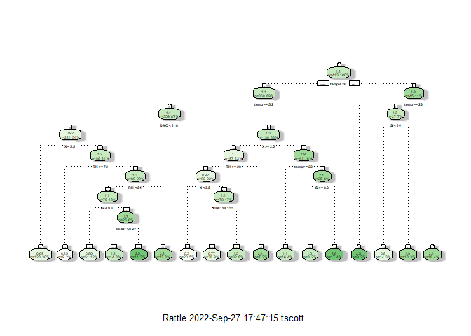<!-- -->

## Check predictions and RMSE

``` r
# get predictions
predict_tree <- predict(myTree, newdata=testData, type='vector')

# compute RMSE
myRMSE(predict_tree, testData$logArea)
```

    ## [1] 1.44907

### This RMSE is actually worse than the multi-linear model

### Try adjusting the complexity parameter (default model has cp = 0.02246242) from the summary()

``` r
# check how error and cp vary
# looks like it can't get any better 
# (larger cp would likely produce a single node)
printcp(myTree)
```

    ## 
    ## Regression tree:
    ## rpart(formula = logArea ~ . - area, data = trainingData, method = "anova")
    ## 
    ## Variables actually used in tree construction:
    ## [1] DMC  FFMC ISI  RH   temp X   
    ## 
    ## Root node error: 816.48/413 = 1.977
    ## 
    ## n= 413 
    ## 
    ##          CP nsplit rel error xerror     xstd
    ## 1  0.022462      0   1.00000 1.0081 0.077693
    ## 2  0.022363      1   0.97754 1.0504 0.079819
    ## 3  0.018939      2   0.95517 1.0731 0.081073
    ## 4  0.017636      5   0.89782 1.1269 0.088942
    ## 5  0.017626      6   0.88019 1.1343 0.089119
    ## 6  0.015334      7   0.86256 1.1862 0.089803
    ## 7  0.013836      8   0.84723 1.2203 0.091676
    ## 8  0.013535     11   0.80572 1.2318 0.092046
    ## 9  0.012193     12   0.79219 1.2508 0.093342
    ## 10 0.011842     13   0.77999 1.2627 0.093869
    ## 11 0.010875     14   0.76815 1.2556 0.093924
    ## 12 0.010096     15   0.75728 1.2486 0.094223
    ## 13 0.010000     16   0.74718 1.2510 0.092958

``` r
plotcp(myTree)
```

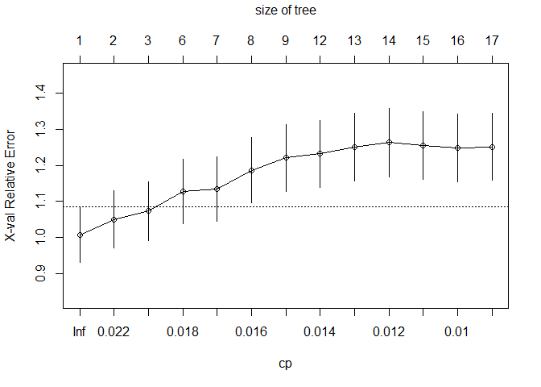<!-- -->

``` r
# prune it with larger and smaller
prunedTreeMoreCP <- prune.rpart(myTree,cp=0.025)
fancyRpartPlot(prunedTreeMoreCP)
```

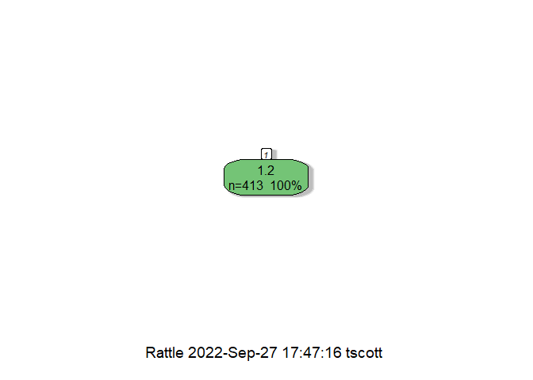<!-- -->

``` r
prunedTreeLessCP <- prune.rpart(myTree, cp=0.005)
fancyRpartPlot(prunedTreeLessCP)
```

<!-- -->

``` r
predicted_tree_largeCP <- predict(prunedTreeMoreCP, testData)
predicted_tree_smallCP <- predict(prunedTreeLessCP, testData)
```

## Check RMSE for each of these pruned trees

``` r
(rmseBigCP <- myRMSE(predicted_tree_largeCP, testData$logArea))
```

    ## [1] 1.365908

``` r
(rmseSmallCP <- myRMSE(predicted_tree_smallCP, testData$logArea))
```

    ## [1] 1.44907

## Wow, the larger CP tree, that shows only one node, has a slightly better RMSE than the multilinear model (1.377032)!

## Time for Random Forest

``` r
# libraries
#install.packages("randomForest")
library(randomForest)
```

    ## randomForest 4.7-1.1

    ## Type rfNews() to see new features/changes/bug fixes.

    ## 
    ## Attaching package: 'randomForest'

    ## The following object is masked from 'package:rattle':
    ## 
    ##     importance

    ## The following object is masked from 'package:dplyr':
    ## 
    ##     combine

    ## The following object is masked from 'package:ggplot2':
    ## 
    ##     margin

``` r
# make the forests
start1 <- Sys.time()
myForest <- randomForest(data=trainingData, logArea ~ .-area)
end1 <- Sys.time()          # Finishing time
(time1 <- end1 - start1) # total time
```

    ## Time difference of 0.8666499 secs

``` r
# takes quite a bit longer than decision tree

# check it out 
myForest
```

    ## 
    ## Call:
    ##  randomForest(formula = logArea ~ . - area, data = trainingData) 
    ##                Type of random forest: regression
    ##                      Number of trees: 500
    ## No. of variables tried at each split: 3
    ## 
    ##           Mean of squared residuals: 2.165693
    ##                     % Var explained: -9.55

``` r
# best model?
which.min(myForest$mse)
```

    ## [1] 354

``` r
# RMSE of that model?
sqrt(myForest$mse[which.min(myForest$mse)])
```

    ## [1] 1.466201

### darn, this RMSE is still not as good as multi-linear model. Using 215 trees!

``` r
# What other amounts can we try based on the error plot?
plot(myForest)
```

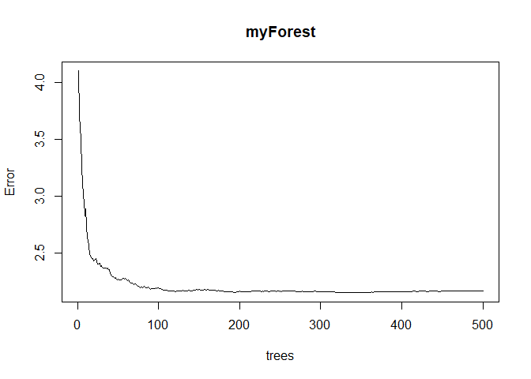<!-- -->

``` r
# looks like potentially other candidates but 215 does look to be the min 

# how about variable importance
varImpPlot(myForest)
```

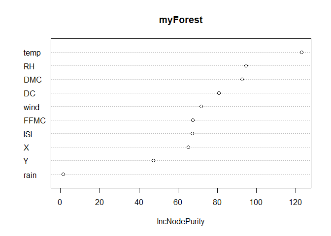<!-- -->

### not surprisingly, temp, RH, and DMC (Duff moisture code, so probably some kind of wetness) are the most important

### Time to adjust some parameters for the random forest

example for tuneRF from <https://www.statology.org/random-forest-in-r/>
model_tuned \<- tuneRF( x=airquality\[,-1\], \#define predictor
variables y=airquality$Ozone, \#define response variable ntreeTry=500,
mtryStart=4, stepFactor=1.5, improve=0.01, trace=FALSE \#don’t show
real-time progress )

``` r
ncol(trainingData)
```

    ## [1] 12

``` r
str(trainingData)
```

    ## 'data.frame':    413 obs. of  12 variables:
    ##  $ X      : int  1 7 6 4 7 6 2 4 4 8 ...
    ##  $ Y      : int  5 4 5 3 4 3 2 4 4 6 ...
    ##  $ FFMC   : num  91 94.3 92.6 93.7 91.6 91.1 92.4 95.8 95.1 92.1 ...
    ##  $ DMC    : num  129.5 96.3 115.4 101.3 104.2 ...
    ##  $ DC     : num  693 200 777 423 475 ...
    ##  $ ISI    : num  7 56.1 8.8 14.7 9 7.1 12.2 13.8 17.7 8.2 ...
    ##  $ temp   : num  21.6 21 24.3 26.1 24.2 19.3 19.6 32.4 19.4 26.8 ...
    ##  $ RH     : int  33 44 27 45 32 39 33 21 71 35 ...
    ##  $ wind   : num  2.2 4.5 4.9 4 1.8 3.6 6.3 4.5 7.6 1.3 ...
    ##  $ rain   : num  0 0 0 0 0 0 0 0 0 0 ...
    ##  $ area   : num  11.53 0 0 7.36 0 ...
    ##  $ logArea: num  2.53 0 0 2.12 0 ...

``` r
# we will want to use columns 1-10 for the tuneRF()

# tune it by messing with starting # of trees, identify best mtry and step
tunedForest <- tuneRF(
  x=trainingData[,1:10],
  y=trainingData$logArea,
  ntreeTry=500,
  #mtryStart = 1, #floor(sqrt(ncol(trainingData)-2)),# sqrt number of predictors
  stepFactor = 0.5,
  improve=0.01,
  trace=FALSE
)
```

    ## -0.007797907 0.01 
    ## 0.0457422 0.01

    ## Warning in randomForest.default(x, y, mtry = mtryCur, ntree = ntreeTry, :
    ## invalid mtry: reset to within valid range

    ## 0.002057467 0.01

    ## Warning in xy.coords(x, y, xlabel, ylabel, log): 1 x value <= 0 omitted from
    ## logarithmic plot

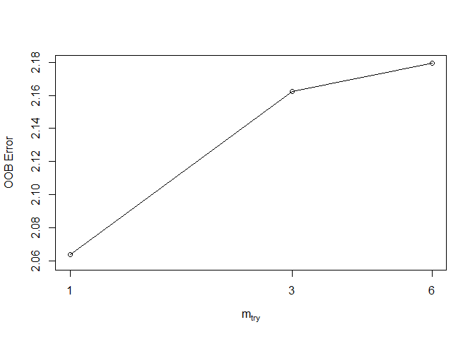<!-- -->

``` r
# seems like a lower error with mtry=1
myTunedForest <- randomForest(data=trainingData, 
                              logArea ~ .-area, 
                              mtry=1)

# check it out 
myTunedForest
```

    ## 
    ## Call:
    ##  randomForest(formula = logArea ~ . - area, data = trainingData,      mtry = 1) 
    ##                Type of random forest: regression
    ##                      Number of trees: 500
    ## No. of variables tried at each split: 1
    ## 
    ##           Mean of squared residuals: 2.071028
    ##                     % Var explained: -4.76

``` r
# best model?
which.min(myTunedForest$mse)
```

    ## [1] 220

``` r
# RMSE of that model?
sqrt(myTunedForest$mse[which.min(myTunedForest$mse)])
```

    ## [1] 1.43542

### slightly lower RMSE for the forest with 159 trees instead of 215

### use that tuned model for predictions

``` r
predictForest <- predict(myTunedForest, testData)

(myTunedForestRMSE <- myRMSE(predictForest, testData$logArea))
```

    ## [1] 1.357878

### TA-DA! A slight improvement in RMSE with this forest!

## Time for XGBoost!

``` r
## Got some guidance from https://www.statology.org/xgboost-in-r/ 

#install.packages("xgboost")
library(xgboost)
```

    ## 
    ## Attaching package: 'xgboost'

    ## The following object is masked from 'package:rattle':
    ## 
    ##     xgboost

    ## The following object is masked from 'package:dplyr':
    ## 
    ##     slice

``` r
set.seed(732)

# prepare train and test by building matrix objects that XGBoost expects
colnames(trainingData)
```

    ##  [1] "X"       "Y"       "FFMC"    "DMC"     "DC"      "ISI"     "temp"   
    ##  [8] "RH"      "wind"    "rain"    "area"    "logArea"

``` r
# want columns 1-10 as features and 12 as the label (outcome)
train_x <- data.matrix(trainingData[,1:10])
train_y <- trainingData[,12]

test_x <- data.matrix(testData[,1:10])
test_y <- testData[,12]

#define final training and testing sets
xgb_train = xgb.DMatrix(data = train_x, label = train_y)
xgb_test = xgb.DMatrix(data = test_x, label = test_y)

#define watchlist
watchlist = list(train=xgb_train, test=xgb_test)

#fit XGBoost model and display training and testing data at each round
model = xgb.train(data = xgb_train, max.depth = 3, watchlist=watchlist, nrounds = 50)
```

    ## [1]  train-rmse:1.450053 test-rmse:1.344310 
    ## [2]  train-rmse:1.388955 test-rmse:1.335529 
    ## [3]  train-rmse:1.358071 test-rmse:1.338748 
    ## [4]  train-rmse:1.317702 test-rmse:1.357439 
    ## [5]  train-rmse:1.301241 test-rmse:1.351786 
    ## [6]  train-rmse:1.288188 test-rmse:1.363785 
    ## [7]  train-rmse:1.274080 test-rmse:1.373178 
    ## [8]  train-rmse:1.268593 test-rmse:1.378762 
    ## [9]  train-rmse:1.252829 test-rmse:1.369464 
    ## [10] train-rmse:1.244272 test-rmse:1.370242 
    ## [11] train-rmse:1.239520 test-rmse:1.373974 
    ## [12] train-rmse:1.230504 test-rmse:1.379228 
    ## [13] train-rmse:1.221850 test-rmse:1.386538 
    ## [14] train-rmse:1.214127 test-rmse:1.381481 
    ## [15] train-rmse:1.198040 test-rmse:1.380781 
    ## [16] train-rmse:1.189487 test-rmse:1.377397 
    ## [17] train-rmse:1.178679 test-rmse:1.376910 
    ## [18] train-rmse:1.164096 test-rmse:1.378447 
    ## [19] train-rmse:1.153029 test-rmse:1.386583 
    ## [20] train-rmse:1.150308 test-rmse:1.391977 
    ## [21] train-rmse:1.136027 test-rmse:1.398503 
    ## [22] train-rmse:1.110882 test-rmse:1.422628 
    ## [23] train-rmse:1.104849 test-rmse:1.420202 
    ## [24] train-rmse:1.090299 test-rmse:1.418015 
    ## [25] train-rmse:1.083916 test-rmse:1.427284 
    ## [26] train-rmse:1.079262 test-rmse:1.427855 
    ## [27] train-rmse:1.073582 test-rmse:1.429234 
    ## [28] train-rmse:1.054948 test-rmse:1.428397 
    ## [29] train-rmse:1.041595 test-rmse:1.439877 
    ## [30] train-rmse:1.036492 test-rmse:1.442501 
    ## [31] train-rmse:1.025751 test-rmse:1.444893 
    ## [32] train-rmse:1.011475 test-rmse:1.442474 
    ## [33] train-rmse:0.999873 test-rmse:1.437082 
    ## [34] train-rmse:0.984532 test-rmse:1.443913 
    ## [35] train-rmse:0.976353 test-rmse:1.447172 
    ## [36] train-rmse:0.968514 test-rmse:1.450307 
    ## [37] train-rmse:0.958230 test-rmse:1.457874 
    ## [38] train-rmse:0.942313 test-rmse:1.461431 
    ## [39] train-rmse:0.933745 test-rmse:1.459678 
    ## [40] train-rmse:0.926701 test-rmse:1.459146 
    ## [41] train-rmse:0.915463 test-rmse:1.467618 
    ## [42] train-rmse:0.898390 test-rmse:1.477979 
    ## [43] train-rmse:0.895432 test-rmse:1.484167 
    ## [44] train-rmse:0.882070 test-rmse:1.478662 
    ## [45] train-rmse:0.878679 test-rmse:1.485674 
    ## [46] train-rmse:0.874894 test-rmse:1.484313 
    ## [47] train-rmse:0.871645 test-rmse:1.485775 
    ## [48] train-rmse:0.862299 test-rmse:1.493683 
    ## [49] train-rmse:0.858968 test-rmse:1.494520 
    ## [50] train-rmse:0.855632 test-rmse:1.494808

### best model happened in round 2 with RMSE 1.335, an improvement! Let’s build that model and then we can later tweak some parameters.

``` r
#define final model
final = xgb.train(data = xgb_train, max.depth = 3, nrounds = 2, verbose = 0)

# use it to predict and confirm RMSE
pred_xgb <- predict(final, test_x)

# get RMSE - same as above 1.3355
(myRMSE(pred_xgb, test_y))
```

    ## [1] 1.335529

``` r
# variable importance?
importance_matrix <- xgb.importance(model = final)
xgb.plot.importance(importance_matrix, xlab = "Feature Importance")
```

<!-- -->

### we see that XGBoost has penalized several of the features (with its built in L1 and L2 regularization) so that the remaining best features are temperature, wind, DMC, RH, and FFMC

### let’s do a grid search to find the best parameters using the code from the r-bloggers post I referenced in class

``` r
## Code from https://www.r-bloggers.com/2020/11/r-xgboost-regression/

#################
#grid search
#create hyperparameter grid
hyper_grid <- expand.grid(max_depth = seq(2, 8, 1),
                          eta = seq(.05, .45, .01))
xgb_train_rmse <- NULL
xgb_test_rmse <- NULL

for (j in 1:nrow(hyper_grid)) {
  set.seed(732)
  m_xgb_untuned <- xgb.cv(
    data = train_x,
    label = train_y,
    nrounds = 500,
    objective = "reg:squarederror",
    early_stopping_rounds = 3,
    nfold = 5,
    max_depth = hyper_grid$max_depth[j],
    eta = hyper_grid$eta[j],
    verbose = FALSE
  )
  
  xgb_train_rmse[j] <- m_xgb_untuned$evaluation_log$train_rmse_mean[m_xgb_untuned$best_iteration]
  xgb_test_rmse[j] <- m_xgb_untuned$evaluation_log$test_rmse_mean[m_xgb_untuned$best_iteration]
  
  #cat(j, "\n")
}

#ideal hyperparamters
hyper_grid[which.min(xgb_test_rmse), ]
```

    ##     max_depth  eta
    ## 134         2 0.24

### OK, with those parameters, build that model and allow for more rounds

``` r
#define final model
finalXGB = xgb.train(data = xgb_train, 
                   max.depth = 2, 
                   watchlist=watchlist, 
                   eta=0.24,
                   lambda = 0.1,
                   alpha = 0.9,
                   nrounds = 500, 
                   verbose = 0)

# round 3 is best testRMSE (1.330)
finalXGB = xgb.train(data = xgb_train, 
                   max.depth = 2, 
                   watchlist=watchlist, 
                   eta=0.24, 
                   nrounds = 4, 
                   verbose = 0)

# use it to predict and confirm RMSE
pred_xgb <- predict(finalXGB, test_x)

# get RMSE - same as above 1.3355
print('The best model RMSE is')
```

    ## [1] "The best model RMSE is"

``` r
(myRMSE(pred_xgb, test_y))
```

    ## [1] 1.321325

``` r
# variable importance?
importance_matrix <- xgb.importance(model = final)
xgb.plot.importance(importance_matrix, xlab = "Feature Importance")
```

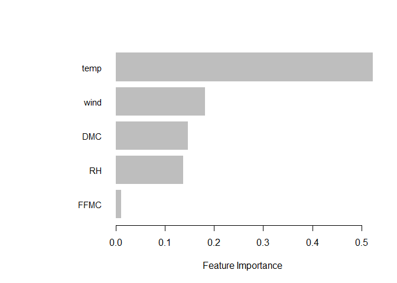<!-- -->

## Hooray, got an even better RMSE with that bit of tuning. Now have a model with a RMSE = 1.321

## Time for a Neural Network!

### Will use the neuralnet package, one of many options in R

Guidance from <https://www.r-bloggers.com/2019/09/r-neural-network/>
<https://datascienceplus.com/neuralnet-train-and-test-neural-networks-using-r/>
and the vignette for the neuralnet package

``` r
# install needed package

#install.packages("neuralnet")
library(neuralnet)
```

    ## 
    ## Attaching package: 'neuralnet'

    ## The following object is masked from 'package:dplyr':
    ## 
    ##     compute

### Train first network

``` r
# normalization function
normalizeMe <- function(x) {
  return ((x - min(x))/(max(x) - min(x)))
}

# need to normalize full data set before splitting
forestNumNorm <- as.data.frame(lapply(forestNum, normalizeMe))

# check results
summary(forestNumNorm)
```

    ##        X                Y               FFMC             DMC        
    ##  Min.   :0.0000   Min.   :0.0000   Min.   :0.0000   Min.   :0.0000  
    ##  1st Qu.:0.2500   1st Qu.:0.2857   1st Qu.:0.9226   1st Qu.:0.2326  
    ##  Median :0.3750   Median :0.2857   Median :0.9406   Median :0.3694  
    ##  Mean   :0.4587   Mean   :0.3285   Mean   :0.9283   Mean   :0.3783  
    ##  3rd Qu.:0.7500   3rd Qu.:0.4286   3rd Qu.:0.9574   3rd Qu.:0.4869  
    ##  Max.   :1.0000   Max.   :1.0000   Max.   :1.0000   Max.   :1.0000  
    ##        DC              ISI              temp              RH        
    ##  Min.   :0.0000   Min.   :0.0000   Min.   :0.0000   Min.   :0.0000  
    ##  1st Qu.:0.5040   1st Qu.:0.1159   1st Qu.:0.4277   1st Qu.:0.2118  
    ##  Median :0.7697   Median :0.1497   Median :0.5498   Median :0.3176  
    ##  Mean   :0.6333   Mean   :0.1608   Mean   :0.5366   Mean   :0.3446  
    ##  3rd Qu.:0.8280   3rd Qu.:0.1925   3rd Qu.:0.6624   3rd Qu.:0.4471  
    ##  Max.   :1.0000   Max.   :1.0000   Max.   :1.0000   Max.   :1.0000  
    ##       wind             rain               area              logArea       
    ##  Min.   :0.0000   Min.   :0.000000   Min.   :0.0000000   Min.   :0.00000  
    ##  1st Qu.:0.2556   1st Qu.:0.000000   1st Qu.:0.0000000   1st Qu.:0.00000  
    ##  Median :0.4000   Median :0.000000   Median :0.0004767   Median :0.05985  
    ##  Mean   :0.4020   Mean   :0.003385   Mean   :0.0117774   Mean   :0.15882  
    ##  3rd Qu.:0.5000   3rd Qu.:0.000000   3rd Qu.:0.0060229   3rd Qu.:0.28935  
    ##  Max.   :1.0000   Max.   :1.000000   Max.   :1.0000000   Max.   :1.00000

``` r
# everything between 0 and 1 as desired

# to save pain, going to drop "area" from data set before splitting, since we're always using logArea
# this means label column is 11, not 12, and features are 1-10
forestNumNorm <- forestNumNorm %>% select(-area)

# split the data as before
set.seed(732)  # same
trainingRowIndex <- sample(1:nrow(forestNumNorm), 0.8*nrow(forestNumNorm)) 
trainDataNN <- forestNumNorm[trainingRowIndex, ]  
testDataNN  <- forestNumNorm[-trainingRowIndex, ]

# build formula for model
n <- colnames(forestNumNorm)[1:10]
f <- as.formula(paste("logArea ~", paste(n[!n %in% "logArea"], collapse = " + ")))

# check formula
(f)
```

    ## logArea ~ X + Y + FFMC + DMC + DC + ISI + temp + RH + wind + 
    ##     rain

``` r
# time this block
start1 <- Sys.time()

# train network with one hidden layer, 5 nodes
m1_nn <- neuralnet(f,
                   data = trainDataNN,
                   hidden = c(5),
                   linear.output = TRUE) # regression

end1 <- Sys.time() # Finishing time
(time1 <- end1 - start1) # output total time
```

    ## Time difference of 4.457934 secs

``` r
# predictions
pred_nn <- predict(m1_nn, testDataNN)

# de-normalize predicted output for logArea
yhat <- pred_nn * (max(forestNum$logArea) - min(forestNum$logArea)) + min(forestNum$logArea)

# same for true values
y <- testDataNN[, 11] * (max(forestNum$logArea) - min(forestNum$logArea)) + min(forestNum$logArea)

# ooh, does this work for us? only if I install caret - not now
#postResample(yhat, y)

# visualize it
plot(m1_nn, rep="best")
```

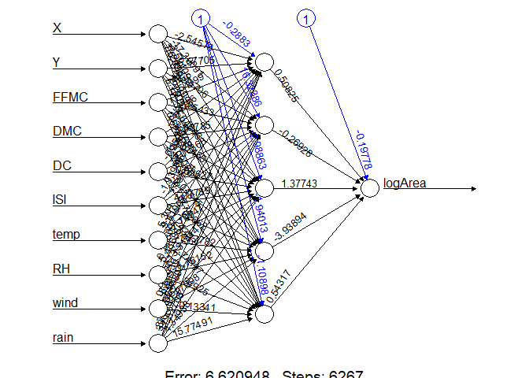<!-- -->

``` r
# get RMSE - best so far is 1.321 from XGBoost
(myRMSE(yhat, y))
```

    ## [1] 1.561844

``` r
# not better yet! 1.560 from this model
```

### That model is not better, and also it took \~21 seconds to run. Time to try adding another hidden layer

``` r
start1 <- Sys.time()

# train network with two hidden layers, 5 nodes, and 2 nodes
m2_nn <- neuralnet(f,
                   data = trainDataNN,
                   hidden = c(5,2),
                   linear.output = TRUE) # regression

end1 <- Sys.time() # Finishing time
(time1 <- end1 - start1) # output total time
```

    ## Time difference of 11.67757 secs

``` r
# predictions
pred_nn <- predict(m2_nn, testDataNN)

# de-normalize predicted output for logArea
yhat <- pred_nn * (max(forestNum$logArea) - min(forestNum$logArea)) + min(forestNum$logArea)

# same for true values
y <- testDataNN[, 11] * (max(forestNum$logArea) - min(forestNum$logArea)) + min(forestNum$logArea)

# visualize it
plot(m2_nn, rep="best")
```

<!-- -->

``` r
# get RMSE - best so far is 1.321 from XGBoost
(myRMSE(yhat, y))
```

    ## [1] 1.600635

``` r
# Worse! 1.693 from this model
```

## try a basic loop structure to explore hidden layer sizes. Just one layer this time.

``` r
NN_rmse <- NULL

for(j in seq(2,7,1)) {
  
  start1 <- Sys.time()
  mj_nn <- neuralnet(f,
                   data = trainDataNN,
                   hidden = c(j),
                   linear.output = TRUE) # regression

  pred_nn <- predict(mj_nn, testDataNN)
  yhat <- pred_nn * (max(forestNum$logArea) - min(forestNum$logArea)) + min(forestNum$logArea)
  y <- testDataNN[, 11] * (max(forestNum$logArea) - min(forestNum$logArea)) + min(forestNum$logArea)
  cat(j, "\n")
  NN_rmse[j] <- paste("Network with hidden layer of", j, "nodes. RMSE=", myRMSE(yhat, y))
  
}
```

    ## 2 
    ## 3 
    ## 4 
    ## 5 
    ## 6 
    ## 7

``` r
# output results
(NN_rmse)
```

    ## [1] NA                                                            
    ## [2] "Network with hidden layer of 2 nodes. RMSE= 1.43025016830809"
    ## [3] "Network with hidden layer of 3 nodes. RMSE= 1.52593337361633"
    ## [4] "Network with hidden layer of 4 nodes. RMSE= 1.58057170151513"
    ## [5] "Network with hidden layer of 5 nodes. RMSE= 1.817133444371"  
    ## [6] "Network with hidden layer of 6 nodes. RMSE= 1.71656239640236"
    ## [7] "Network with hidden layer of 7 nodes. RMSE= 1.57794329703513"

### Crazy, the best network with only one layer has 2 nodes. RMSE 1.397 is still not better than multilinear model even. Let’s try two hidden layers.

``` r
# make data frame for results
NN_rmse_df <- data.frame(layer1 = 0, layer2 = 0, RMSE = 0)

#startfull <- Sys.time()

# first layer from 2 - 6 nodes, second from 1 - 3 nodes
for(i in seq(1,6,1)) {
  for(j in seq(0,3,1)) {
    
    #time each model build
    start1 <- Sys.time()
    hid <- ifelse(j==0, c(i), c(i,j)) # to handle case of zero nodes in layer 2
    mj_nn <- neuralnet(f,
                     data = trainDataNN,
                     hidden=hid,
                     linear.output = TRUE) # regression
    time1 <- Sys.time() - start1 
    
    #predictions
    pred_nn <- predict(mj_nn, testDataNN)
    yhat <- pred_nn * (max(forestNum$logArea) - min(forestNum$logArea)) + min(forestNum$logArea)
    y <- testDataNN[, 11] * (max(forestNum$logArea) - min(forestNum$logArea)) + min(forestNum$logArea)
    cat("First layer", i, "second layer", j, "runtime (s)", time1, "\n")
    
    #build up result data
    temp_df <- data.frame(layer1 = i, layer2 = j, RMSE = myRMSE(yhat, y))
    NN_rmse_df <- rbind(NN_rmse_df, temp_df)
    
  }
}
```

    ## First layer 1 second layer 0 runtime (s) 0.06494403 
    ## First layer 1 second layer 1 runtime (s) 0.03977203 
    ## First layer 1 second layer 2 runtime (s) 0.008586168 
    ## First layer 1 second layer 3 runtime (s) 0.04202604 
    ## First layer 2 second layer 0 runtime (s) 0.608427 
    ## First layer 2 second layer 1 runtime (s) 0.3630328 
    ## First layer 2 second layer 2 runtime (s) 1.824716 
    ## First layer 2 second layer 3 runtime (s) 1.773066 
    ## First layer 3 second layer 0 runtime (s) 6.264121 
    ## First layer 3 second layer 1 runtime (s) 1.318322 
    ## First layer 3 second layer 2 runtime (s) 9.69724 
    ## First layer 3 second layer 3 runtime (s) 3.473836 
    ## First layer 4 second layer 0 runtime (s) 8.343111 
    ## First layer 4 second layer 1 runtime (s) 4.372067 
    ## First layer 4 second layer 2 runtime (s) 8.837209 
    ## First layer 4 second layer 3 runtime (s) 1.307854 
    ## First layer 5 second layer 0 runtime (s) 4.645633 
    ## First layer 5 second layer 1 runtime (s) 5.775751 
    ## First layer 5 second layer 2 runtime (s) 25.08276 
    ## First layer 5 second layer 3 runtime (s) 20.27119 
    ## First layer 6 second layer 0 runtime (s) 5.399728 
    ## First layer 6 second layer 1 runtime (s) 35.4542 
    ## First layer 6 second layer 2 runtime (s) 13.8985 
    ## First layer 6 second layer 3 runtime (s) 20.97014

``` r
# full runtime
#cat("Entire set took", Sys.time() - startfull, "seconds to run", "\n")

# output results
arrange(NN_rmse_df, RMSE)
```

    ##    layer1 layer2     RMSE
    ## 1       0      0 0.000000
    ## 2       1      2 1.365992
    ## 3       1      3 1.375886
    ## 4       1      0 1.376592
    ## 5       1      1 1.379389
    ## 6       2      3 1.382897
    ## 7       3      3 1.397476
    ## 8       2      0 1.406315
    ## 9       4      3 1.412238
    ## 10      3      1 1.417000
    ## 11      2      2 1.431332
    ## 12      5      0 1.433516
    ## 13      2      1 1.467188
    ## 14      3      0 1.470586
    ## 15      3      2 1.482318
    ## 16      6      3 1.485960
    ## 17      6      1 1.494283
    ## 18      4      1 1.514468
    ## 19      5      3 1.519345
    ## 20      4      2 1.539592
    ## 21      5      1 1.568392
    ## 22      6      0 1.594108
    ## 23      4      0 1.606960
    ## 24      5      2 1.637912
    ## 25      6      2 1.674454

### Best network model: 1 node in first layer, 3 in second!

``` r
start1 <- Sys.time()

# train network with two hidden layers, 1 nodes, and 3 nodes
mbest_nn <- neuralnet(f,
                   data = trainDataNN,
                   hidden = c(1,3),
                   linear.output = TRUE) # regression

end1 <- Sys.time() # Finishing time
(time1 <- end1 - start1) # output total time
```

    ## Time difference of 0.07094121 secs

``` r
# predictions
pred_nn <- predict(mbest_nn, testDataNN)

# de-normalize predicted output for logArea
yhat <- pred_nn * (max(forestNum$logArea) - min(forestNum$logArea)) + min(forestNum$logArea)

# same for true values
y <- testDataNN[, 11] * (max(forestNum$logArea) - min(forestNum$logArea)) + min(forestNum$logArea)

# visualize it
plot(mbest_nn, rep="best")
```

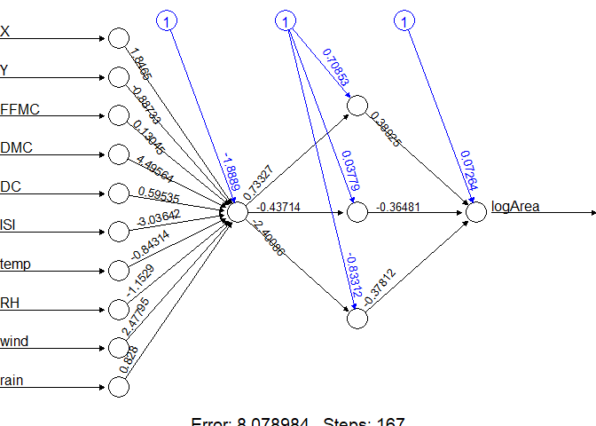<!-- -->

``` r
# get RMSE - best so far is 1.321 from XGBoost
(myRMSE(yhat, y))
```

    ## [1] 1.381802

### we would want to run a cross-validation to get a better error estimate, but it looks like this neural network varies from around 1.365 to 1.41 for RMSE. Not better than XGBoost, and only sometimes better than previous models.
